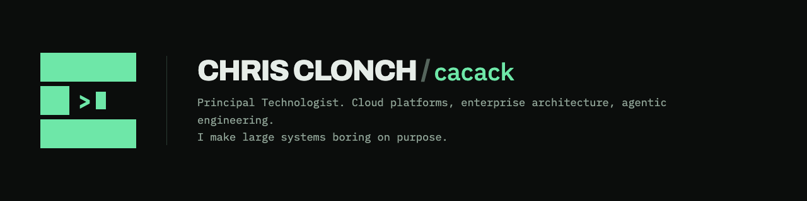

Located in Ohio, I build castles in the sky for my day job.
Most of what's here exists because I had a problem, looked at the available solution, and decided I'd rather maintain my own.
Results vary.
The commit history is honest about it.

## Things I actually use

- **[my-family](https://github.com/cacack/my-family)** — self-hosted genealogy software that takes sourcing seriously and storytelling more seriously.
  Built on **[gedcom-go](https://github.com/cacack/gedcom-go)**, a Go parser for a file format designed in 1984 and never fully agreed upon since.
- **[ferrocv](https://github.com/cacack/ferrocv)** — renders JSON Resume through Typst.
  Written in Rust, so my resume now has a build step and a lockfile.
  There's a [starter template](https://github.com/cacack/ferrocv-example) if you want the same problem.
- **[waterforge](https://github.com/cacack/waterforge)** — clone bottled mineral water from distilled water and food-grade salts.
  Cheaper than the bottle, considerably more effort, which was never the point.
- **[sortpics-go](https://github.com/cacack/sortpics-go)** — files two decades of photos by what the EXIF says rather than what the filename claims.
- **[roulette-wheel](https://github.com/cacack/roulette-wheel)** — a physics-accurate American roulette wheel in Go and Ebitengine.
  It faithfully reproduces the house edge, which is the one feature nobody requested.

## Letting an LLM touch things it probably shouldn't

MCP servers for [VyOS](https://github.com/cacack/mcp-server-vyos), [Z-Wave JS UI](https://github.com/cacack/mcp-server-zwave-js-ui), and [Spotify](https://github.com/cacack/mcp-server-spotify) — so I can misconfigure my router, my light switches, and my playlists without leaving the terminal.
Plus a [Claude Code plugin collection](https://github.com/cacack/claude-code-plugins) and the [dotfiles](https://github.com/cacack/dotfiles) that carry my opinions between machines.

## Homelab

A tech stack that has outlasted several of my strongly-held beliefs.
Networking, DNS, backups, and every repo I own are declared in Terraform or Ansible — not because it's faster, but because when something breaks at 11pm I'd like to know which commit to blame.

## Stack

Go · Rust · AWS · Terraform · Ansible · Docker · a great deal of YAML I did not ask for
